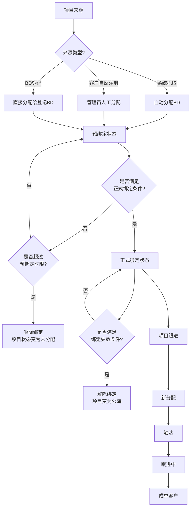
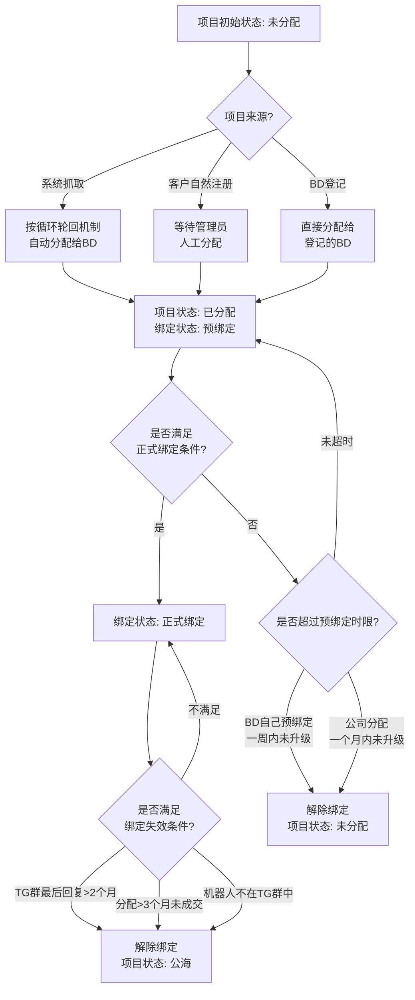
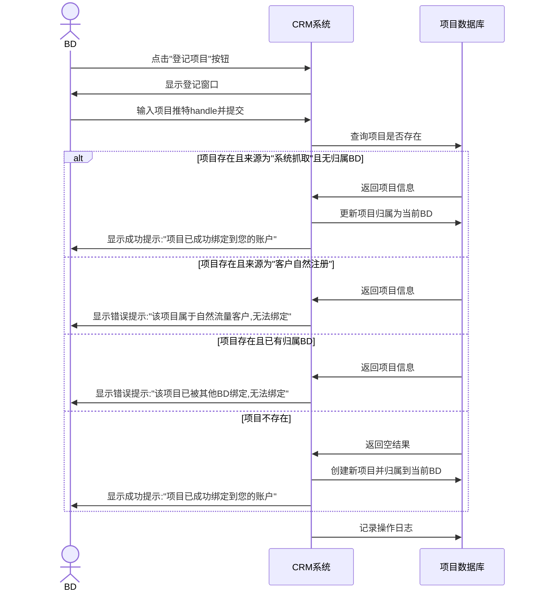
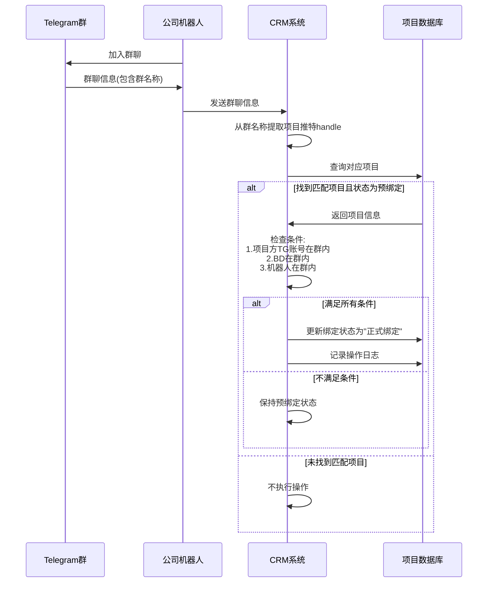
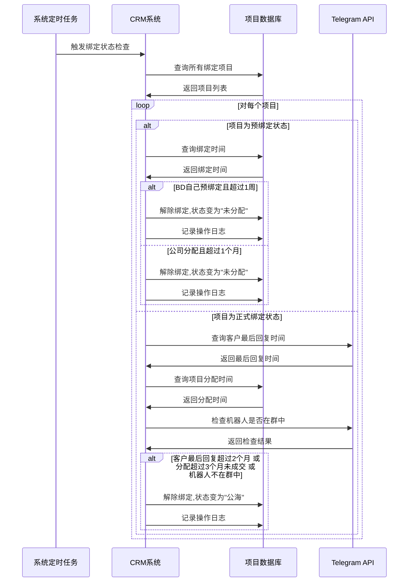
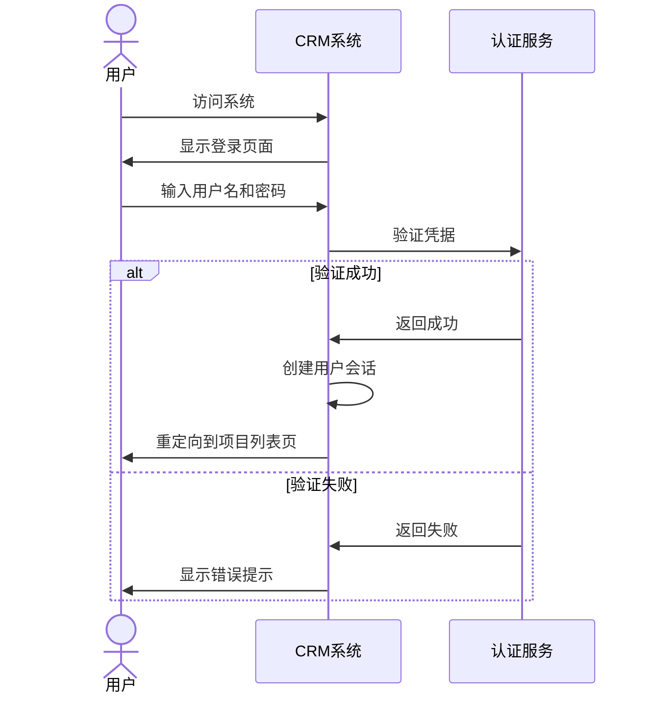
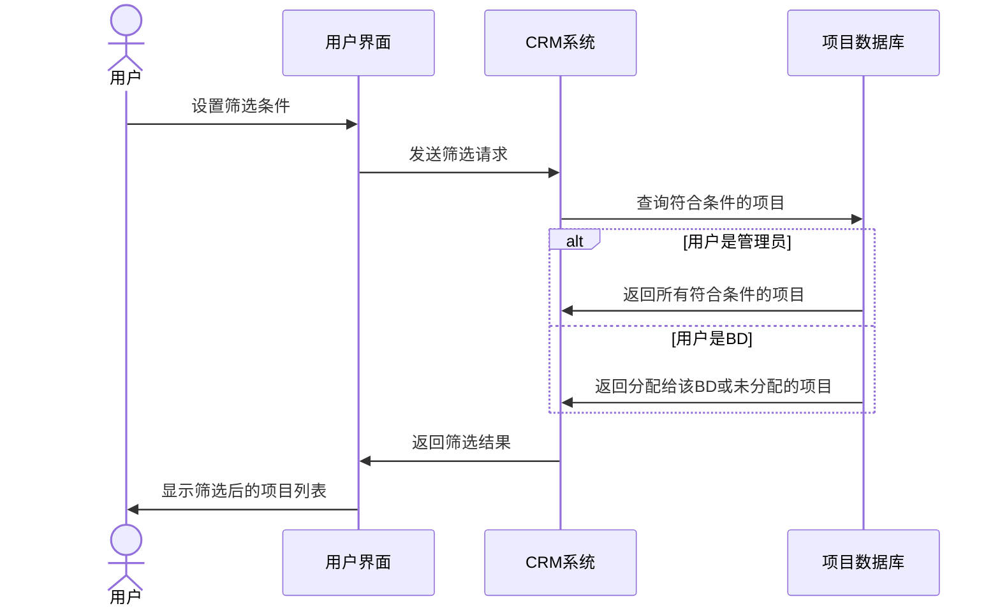

# CRM系统业务流程图和时序图

## 一、全局业务流程图

### 1. 项目管理主流程

```mermaid
flowchart TD
    A[项目来源] --> B{来源类型?}
    B -->|系统抓取| C[自动分配BD]
    B -->|客户自然注册| D[管理员人工分配]
    B -->|BD登记| E[直接分配给登记BD]
    
    C --> F[预绑定状态]
    D --> F
    E --> F
    
    F --> G{是否满足<br>正式绑定条件?}
    G -->|是| H[正式绑定状态]
    G -->|否| I{是否超过<br>预绑定时限?}
    
    I -->|是| J[解除绑定<br>项目状态变为未分配]
    I -->|否| F
    
    H --> K{是否满足<br>绑定失效条件?}
    K -->|是| L[解除绑定<br>项目变为公海]
    K -->|否| H
    
    H --> M[项目跟进]
    M --> N[新分配]
    N --> O[触达]
    O --> P[跟进中]
    P --> Q[成单客户]
```

### 2. 项目BD归属管理流程

```mermaid
flowchart TD
    A[项目初始状态: 未分配] --> B{项目来源?}
    
    B -->|系统抓取| C[按循环轮回机制<br>自动分配给BD]
    B -->|客户自然注册| D[等待管理员<br>人工分配]
    B -->|BD登记| E[直接分配给<br>登记的BD]
    
    C --> F[项目状态: 已分配<br>绑定状态: 预绑定]
    D --> F
    E --> F
    
    F --> G{是否满足<br>正式绑定条件?}
    G -->|是| H[绑定状态: 正式绑定]
    G -->|否| I{是否超过预绑定时限?}
    
    I -->|BD自己预绑定<br>一周内未升级| J[解除绑定<br>项目状态: 未分配]
    I -->|公司分配<br>一个月内未升级| J
    I -->|未超时| F
    
    H --> K{是否满足<br>绑定失效条件?}
    K -->|TG群最后回复>2个月| L[解除绑定<br>项目状态: 公海]
    K -->|分配>3个月未成交| L
    K -->|机器人不在TG群中| L
    K -->|不满足| H
```

## 二、关键业务时序图

### 1. 项目登记流程时序图

```mermaid
sequenceDiagram
    actor BD
    participant System as CRM系统
    participant DB as 项目数据库
    
    BD->>System: 点击"登记项目"按钮
    System->>BD: 显示登记窗口
    BD->>System: 输入项目推特handle并提交
    System->>DB: 查询项目是否存在
    
    alt 项目存在且来源为"系统抓取"且无归属BD
        DB->>System: 返回项目信息
        System->>DB: 更新项目归属为当前BD
        System->>BD: 显示成功提示:"项目已成功绑定到您的账户"
    else 项目存在且来源为"客户自然注册"
        DB->>System: 返回项目信息
        System->>BD: 显示错误提示:"该项目属于自然流量客户,无法绑定"
    else 项目存在且已有归属BD
        DB->>System: 返回项目信息
        System->>BD: 显示错误提示:"该项目已被其他BD绑定,无法绑定"
    else 项目不存在
        DB->>System: 返回空结果
        System->>DB: 创建新项目并归属到当前BD
        System->>BD: 显示成功提示:"项目已成功绑定到您的账户"
    end
    
    System->>DB: 记录操作日志
```

### 2. 预绑定升级为正式绑定时序图

```mermaid
sequenceDiagram
    participant TG as Telegram群
    participant Bot as 公司机器人
    participant System as CRM系统
    participant DB as 项目数据库
    
    Bot->>TG: 加入群聊
    TG->>Bot: 群聊信息(包含群名称)
    Bot->>System: 发送群聊信息
    System->>System: 从群名称提取项目推特handle
    System->>DB: 查询对应项目
    
    alt 找到匹配项目且状态为预绑定
        DB->>System: 返回项目信息
        System->>System: 检查条件:<br>1.项目方TG账号在群内<br>2.BD在群内<br>3.机器人在群内
        
        alt 满足所有条件
            System->>DB: 更新绑定状态为"正式绑定"
            System->>DB: 记录操作日志
        else 不满足条件
            System->>System: 保持预绑定状态
        end
    else 未找到匹配项目
        System->>System: 不执行操作
    end
```

### 3. 绑定失效检测时序图

```mermaid
sequenceDiagram
    participant Scheduler as 系统定时任务
    participant System as CRM系统
    participant DB as 项目数据库
    participant TG as Telegram API
    
    Scheduler->>System: 触发绑定状态检查
    System->>DB: 查询所有绑定项目
    DB->>System: 返回项目列表
    
    loop 对每个项目
        alt 项目为预绑定状态
            System->>DB: 查询绑定时间
            DB->>System: 返回绑定时间
            
            alt BD自己预绑定且超过1周
                System->>DB: 解除绑定,状态变为"未分配"
                System->>DB: 记录操作日志
            else 公司分配且超过1个月
                System->>DB: 解除绑定,状态变为"未分配"
                System->>DB: 记录操作日志
            end
        else 项目为正式绑定状态
            System->>TG: 查询客户最后回复时间
            TG->>System: 返回最后回复时间
            System->>DB: 查询项目分配时间
            DB->>System: 返回分配时间
            System->>TG: 检查机器人是否在群中
            TG->>System: 返回检查结果
            
            alt 客户最后回复超过2个月 或 分配超过3个月未成交 或 机器人不在群中
                System->>DB: 解除绑定,状态变为"公海"
                System->>DB: 记录操作日志
            end
        end
    end
```

## 三、用户交互流程图

### 1. 登录流程

```mermaid
sequenceDiagram
    actor User as 用户
    participant System as CRM系统
    participant Auth as 认证服务
    
    User->>System: 访问系统
    System->>User: 显示登录页面
    User->>System: 输入用户名和密码
    System->>Auth: 验证凭据
    
    alt 验证成功
        Auth->>System: 返回成功
        System->>System: 创建用户会话
        System->>User: 重定向到项目列表页
    else 验证失败
        Auth->>System: 返回失败
        System->>User: 显示错误提示
    end
```

### 2. 项目筛选流程

```mermaid
sequenceDiagram
    actor User as 用户
    participant UI as 用户界面
    participant System as CRM系统
    participant DB as 项目数据库
    
    User->>UI: 设置筛选条件
    UI->>System: 发送筛选请求
    System->>DB: 查询符合条件的项目
    
    alt 用户是管理员
        DB->>System: 返回所有符合条件的项目
    else 用户是BD
        DB->>System: 返回分配给该BD或未分配的项目
    end
    
    System->>UI: 返回筛选结果
    UI->>User: 显示筛选后的项目列表
``` 