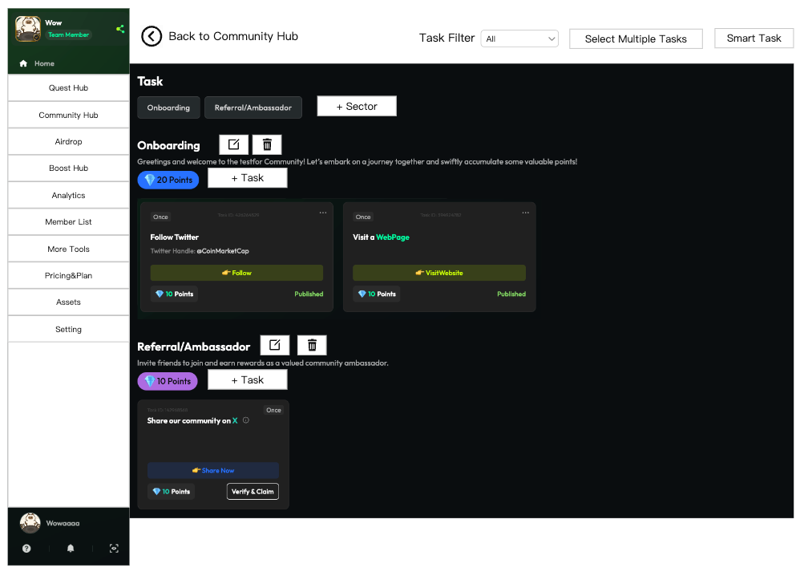
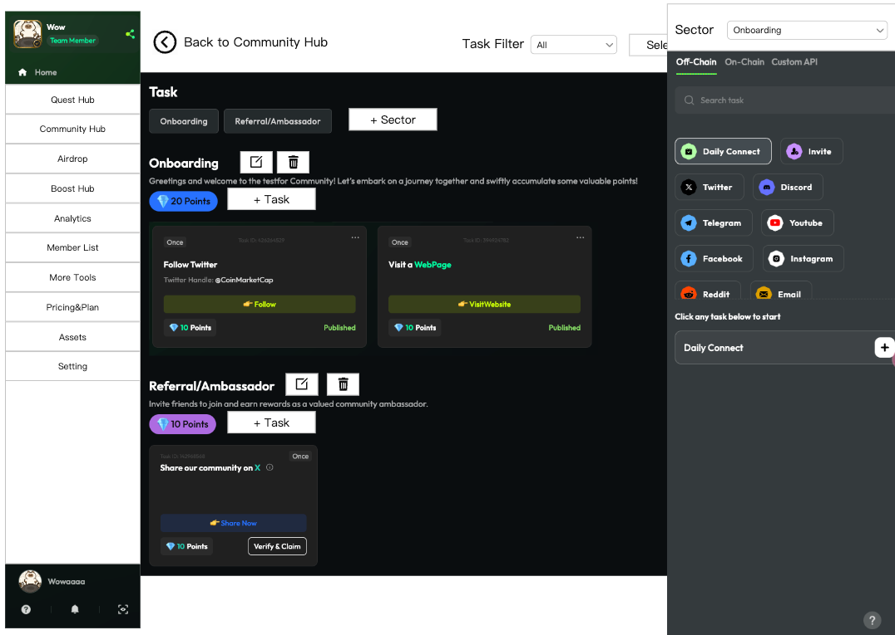
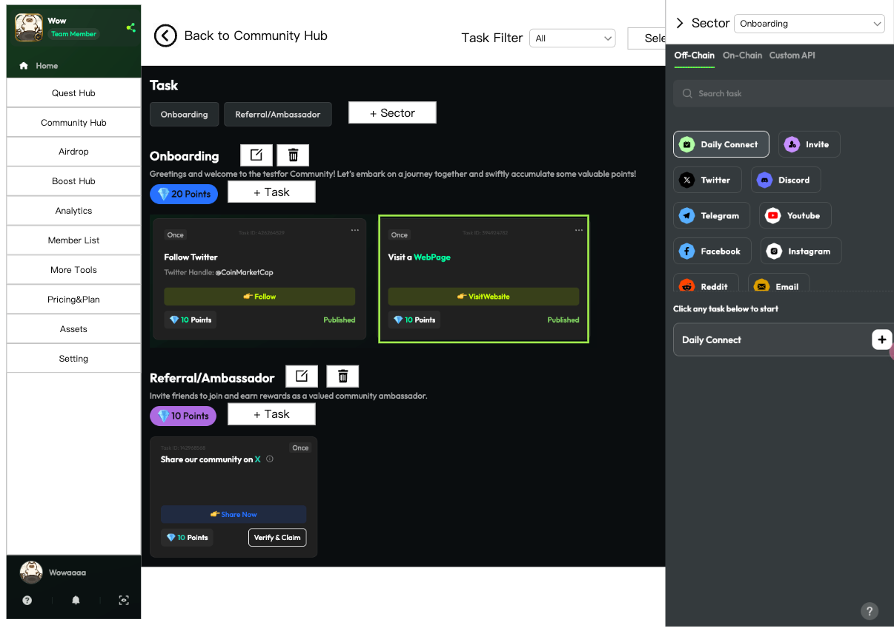
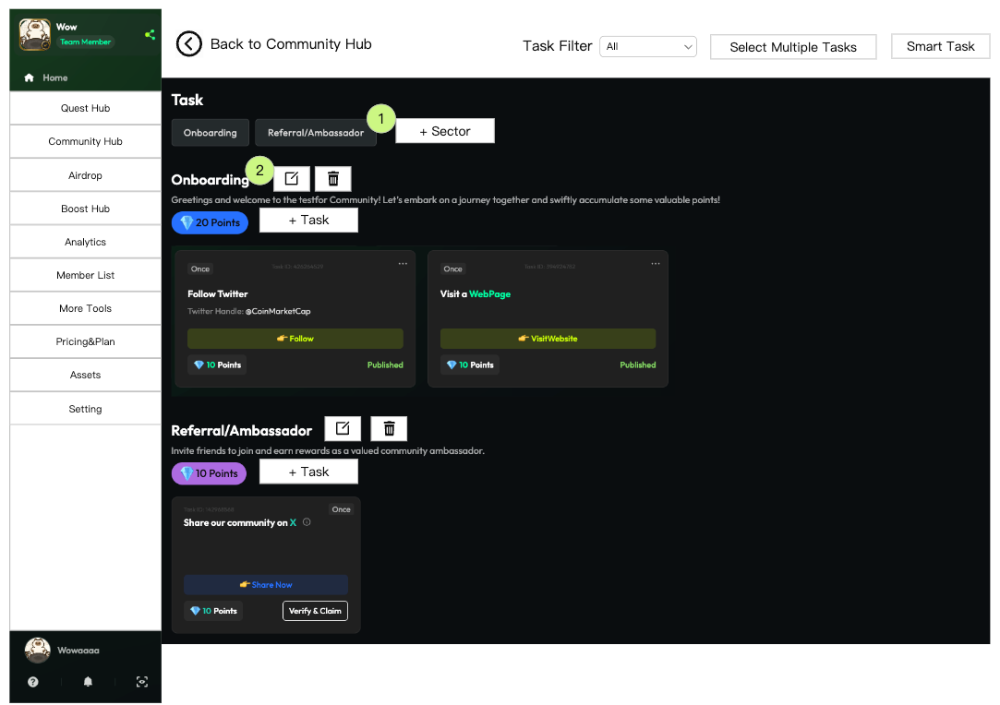
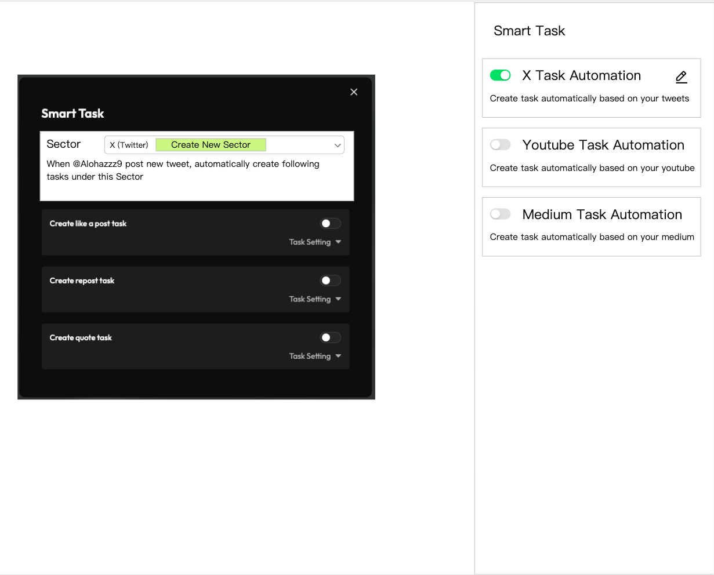

# 产品设计文档模板

## 一、产品概述

### 1. 产品背景

目前Community中编辑task的功能，功能较为复杂，用户难以理解，需要从设计和交互上更贴近所见即所得，让用户更容易使用。

### 2. 产品愿景

让用户更容易理解和使用编辑任务功能，提升用户体验。

### 3. 用户故事

作为社区管理员，我希望能够更直观地编辑任务，让任务编辑过程更加所见即所得，以便更高效地管理社区任务。

## 二、业务流程

### 1. 全局业务流程图

1. 进入Edit Task页面，此时样式基本与C端样式相同，所有Sector的task都是铺开的
2. 用户在对应的Sector下面找到add task按钮
3. 点击按钮，侧划出任务列表
4. 点击加号，弹窗填写任务详情
5. Publish或Save后，页面上出现对应的task卡片
6. 点击Sector旁边的编辑按钮，可编辑相关信息

### 2. 关键子流程图

**添加任务流程：**

**填写任务详情：**

**任务保存后效果：**

**编辑Sector信息：**

## 三、功能设计

### 1. 功能地图

- Edit Task页面
  - Task筛选
  - 多选任务
  - Smart Task功能
  - Sector管理
  - 任务管理
- Add Task功能
- Smart Task功能

### 2. 功能描述模板

#### Edit Task页面

**进入条件**：Community Hub页，点击Edit Task

**页面布局**：
- 顶部是Task的Filter，Select Multiple Tasks，Smart Task三个按钮
- 下面是铺开所有的Sector和任务卡片
- Sector区域，最后有一个add sector的按钮
- Task区域包括Sector Name、Description、积分数、任务卡片
- Sector Name旁边有编辑按钮和删除按钮，下面有add task按钮
- 任务卡片有四种状态：Published、Draft、Delist、Expired

**交互逻辑**：
- 点击Back，返回Community Hub页面
- Task Filter，下拉有All、Published、Draft、Delist、Expired五个选项
- 点击Select Multiple Tasks，进入多选模式
- 点击Smart Task，进入Smart Task配置
- 点击Sector，展示该Sector的task，再次点击取消选中
- 点击Add Sector，弹窗添加Sector
- 点击Sector name旁编辑，打开编辑弹窗
- 点击Sector name旁删除，打开删除确认弹窗

#### Add Task功能

**进入条件**：Edit Task页面，在某个Sector下面，点击Add Task

**侧滑布局**：
- 顶部是当前Sector，这是一个下拉菜单
- 下面的部分，复用当前的添加Task流程

**交互逻辑**：
- 鼠标点击箭头，侧滑会收起
- Sector下拉菜单，可以切换Sector
- 点击添加Task，出现编辑Task信息的弹窗
- 点击Save或Publish，页面上出现对应的task卡片

#### Smart Task功能

**进入条件**：Edit Task页面，点击Smart Task

**侧滑布局**：
- 展示3类Smart Task
- 每一类Smart Task卡片上，展示该Task是否开启，开启时展示编辑按钮
- 整个卡片可点击

**交互逻辑**：
- 每一个Smart Task只能存在于一个Sector
- 点击Smart Task卡片，出现编辑弹窗
- 弹窗中增加了Sector的选择
- 未开启时默认选中Create new Sector

## 四、业务规则

### 1. 业务规则概述

- Sector管理规则：Sector可以创建、编辑、删除，删除时可以选择删除或移动其中的任务
- Task状态管理：任务有Published、Draft、Delist、Expired四种状态
- Smart Task规则：每个Smart Task只能存在于一个Sector

### 2. 业务规则列表模板

| 规则ID | 规则名称 | 规则描述 | 规则类型 |
|--------|---------|---------|---------|
| R001 | Sector删除规则 | 如果Sector下有任务，删除时需要选择删除所有任务或移动到其他Sector | 强制性 |
| R002 | 空Sector显示规则 | 如果一个Sector下没有任务，仍然要显示Sector标题和add task按钮 | 强制性 |
| R003 | Smart Task唯一性 | 每一个Smart Task只能存在于一个Sector | 强制性 |
| R004 | 任务状态显示 | 四种状态(Published、Draft、Delist、Expired)在样式上需有明显区分 | 强制性 |

## 五、数据需求

### 数据流说明

**Task数据结构**：
- 任务ID
- 任务标题
- 任务描述
- 任务状态（Published、Draft、Delist、Expired）
- 所属Sector
- 积分数
- 创建时间
- 更新时间

**Sector数据结构**：
- Sector ID
- Sector名称
- Sector描述
- 包含任务数量
